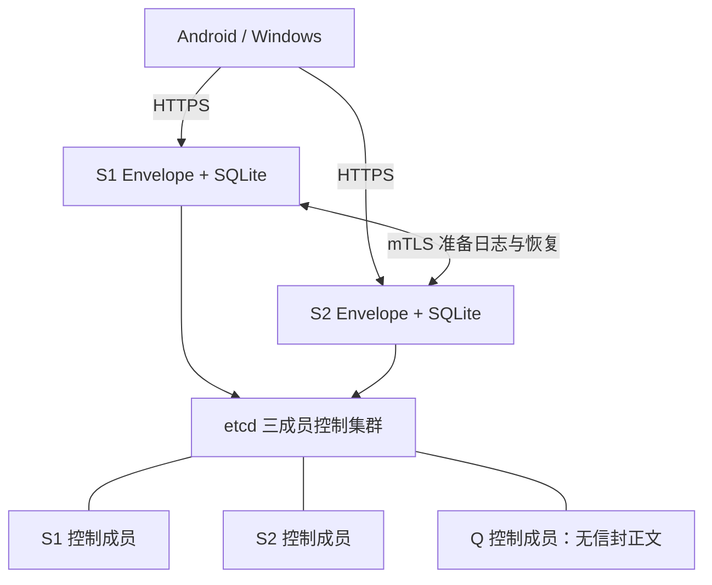

# Envelope 设计基线与首版主备实现设计 / Design Baseline and First-Release HA Design

本文是 Envelope 仓库的单一设计基线，对齐当前 Android 客户端、Windows WPF 客户端、Rust core / FFI、Envelope Server 和部署脚本的实现状态。历史阶段文档已合并到本文，不再作为独立维护对象。

This document is the single design baseline for the Envelope repository. It reflects the current Android client, Windows WPF client, Rust core / FFI, Envelope Server, and deployment scripts. Historical phase documents have been merged here and are no longer maintained separately.

最后更新 / Last updated: 2026-09-20

2026-09-20 首版目标已收敛为 [VPS 主备中继协议](relay-ha-protocol.md) 与 [专项验收标准](relay-ha-acceptance.md)：P2P 优先、主备同步与自动切换、离线信封保留。[多来源发现与客户端选点](vps-discovery-and-selection.md) 延后。目标尚未实现，本文保留现有代码基线；下文 best-effort 同步描述不能作为新首版高可用放行标准。

阅读约定：第 1～14 节保留原有实现基线及既有平台目标；第 16 节是本次新增的首版 HA 实现设计，全部标记为待实现。新发布的通信/确认/切换行为以主备协议及第 16 节为目标，不能把设计选型当成已部署能力。首版正式产品验收仍限 Android 与 Windows，Linux CLI 的既有目标不在本次扩大范围。

## 1. 产品定位 / Product Scope

Envelope 是一个面向 Android 和 Windows 的端到端加密通信项目。消息、文件和群组控制事件都被编码为 opaque 加密信封。客户端负责身份、联系人、加密、解密、本地加密状态和用户确认；Envelope Server 只负责路由、mailbox 兜底、intro session、送达回执、节点清单和节点间 best-effort 同步。

Envelope is an end-to-end encrypted communication project for Android and Windows. Messages, files, and group control events are encoded as opaque encrypted envelopes. The client owns identity, contacts, encryption, decryption, encrypted local state, and user confirmation. Envelope Server only provides routing, mailbox fallback, intro sessions, delivery receipts, node manifests, and best-effort node sync.

服务器和外部工具或渠道不能解密消息内容。服务端不解析信封内部的明文元数据，也不应成为联系人信任或群成员身份确认的来源。

Servers and external tools or channels cannot decrypt message content. The server does not parse plaintext metadata inside envelopes and must not be the source of contact trust or group-member identity confirmation.

当前仓库包含 Android 正式客户端和 Windows WPF 客户端；两者使用相同的 Contact、IntroBundle、opaque envelope、群组控制和服务端协议。Windows 不是开发 CLI 代理，也不会把裸 Identity JSON 作为生产存储。

The repository contains the Android production client and the Windows WPF client. They share Contact, IntroBundle, opaque-envelope, group-control, and server protocols. Windows is not a development CLI proxy and does not use raw Identity JSON as its production storage format.

## 2. 当前功能边界 / Current Functional Boundaries

### 已实现 / Implemented

- Android 五个主入口：关于、联系人、聊天、拆封、设置。 / Five Android entry points: About, Contacts, Chat, Open, and Settings.
- Windows WPF 五个主入口：关于、联系人、聊天、拆封、设置；包含中英文资源和系统/浅色/深色主题。 / Five Windows WPF entry points: About, Contacts, Chat, Open, and Settings, with Chinese/English resources and system/light/dark themes.
- Android Keystore 保护 SQLCipher 数据库口令，本机身份存放于加密数据库。 / Android Keystore protects the SQLCipher database passphrase; the local identity is stored in the encrypted database.
- BIP39 24 词身份创建和身份恢复。 / BIP39 24-word identity creation and recovery.
- 本地锁屏：打开 App 和高风险操作可使用系统 PIN、密码或生物识别确认。 / Local lock: opening the app and sensitive actions can require system PIN, password, or biometrics.
- 本地备份：用 24 词加密导出显示名、身份 key id、同步服务入口、联系人、群组和群成员。 / Local backup: the 24-word phrase encrypts display name, identity key id, sync service entry, contacts, groups, and group members.
- Android / Windows 二维码交换（Windows 生成二维码并读取二维码图片）、剪贴板载荷、短期 intro-session 双向回传，以及保存前 fingerprint 人工确认。 / Android / Windows QR exchange (Windows generation and QR-image decoding), clipboard payloads, short-lived intro-session mutual return, and manual fingerprint confirmation before saving.
- 联系人备注、联系人删除和端到端加密 contact-control 删除通知。 / Contact notes, contact deletion, and end-to-end encrypted contact-control deletion notices.
- 点对点文本和文件发送。 / One-to-one text and file sending.
- 图片、视频文件预览；文件点击优先调用系统默认应用打开，失败时退回保存路径。 / Image and video previews; file taps prefer the system default app and fall back to the saved location.
- 聊天记录分页、消息多选和本机删除。 / Chat history paging, multi-select, and local deletion.
- 64 MiB 内在线文件发送，客户端分片、哈希校验和逐信封加密。 / Online file sending up to 64 MiB, with client chunking, hash verification, and per-envelope encryption.
- 点对点及群组离线密封和拆封，支持文本和本地文件；群组使用逐成员密文流。 / One-to-one and group offline sealing/opening for text and local files, with per-recipient ciphertext streams for groups.
- 普通群、验证群、共识群。 / Normal groups, verified groups, and consensus groups.
- 群邀请在 Android 的邀请者单聊或 Windows 的待处理群会话中呈现，受邀者可接受或拒绝。 / Group invitations appear in the inviter chat on Android or a pending group conversation on Windows; invitees can accept or decline.
- 建群最少 3 人：群主加至少 2 名受邀者。 / Group creation requires at least 3 people: the owner plus at least 2 invitees.
- 群主改群名、更新群头像 seed、邀请成员、移除成员。 / Group owner actions: rename, update avatar seed, invite members, and remove members.
- 群成员状态：pending、accepted、active、left、removed。 / Group member states: pending, accepted, active, left, and removed.
- 群解散原因：群主退群、成员数低于最低 3 人要求。 / Group dissolution reasons: owner leaves or membership falls below the 3-person minimum.
- 群文本和群文件逐成员加密 fan-out。 / Group text and files use per-member encrypted fan-out.
- Android 与 Windows 的在线群文本、群文件和群成员控制通知都会在网络发送前持久化逐成员 outbox 子信封；群控制另使用 `group-event:<event_id>` 逻辑 ID，并在一个本地事务中提交群状态、签名事件和密文子项。部分失败保留 pending 子项，并以不变的 envelope id 做幂等重试。 / Android and Windows durably stage per-recipient outbox children for online group text, group files, and membership-control notifications before network delivery. Group control uses a `group-event:<event_id>` logical ID and commits group state, the signed event, and ciphertext children in one local transaction. Partial failures retain pending children and retry idempotently with stable envelope ids.
- Android 与 Windows 都持久化未读状态；打开单聊或群聊后才把对应入站消息标为已读。 / Android and Windows both persist unread state; inbound messages are marked read only after opening the corresponding contact or group chat.
- 同步服务入口由用户配置，作为中继矩阵 bootstrap。 / The sync service entry is user-configured and acts as the relay matrix bootstrap.
- 签名 NodeSetManifest、多入口节点选择、节点 challenge 校验。 / Signed `NodeSetManifest`, multi-entry node selection, and node challenge verification.
- P2P direct -> server route retry -> server mailbox -> 离线密封文件的投递阶梯。 / Delivery ladder: P2P direct -> server route retry -> server mailbox -> offline sealed file.
- mailbox 拉取、ACK tombstone、送达回执查询。 / Mailbox pull, ACK tombstones, and delivery receipt lookup.
- 服务端 route、mailbox、delivery receipt、ACK tombstone 的 best-effort 节点同步。 / Best-effort server node sync for routes, mailbox items, delivery receipts, and ACK tombstones.
- 客户端 replay / message counter 检测。 / Client replay / message counter detection.
- 客户端诊断日志导出和清空。 / Client diagnostic log export and clearing.
- 关于页显示版本、平台发布校验值（Android APK 签名指纹或 Windows 可执行文件 SHA-256）、用户手册、源代码仓库和许可证。 / About shows version, the platform release verification value (Android APK signing fingerprint or Windows executable SHA-256), manual, source repository, and license.
- Android release APK 签名和 update manifest 生成。 / Android release APK signing and update manifest generation.
- Windows x64 Release 构建、协议验证 harness、FFI DLL 组合、可执行文件 SHA-256 和 zip 打包。 / Windows x64 Release build, protocol verification harness, FFI DLL composition, executable SHA-256, and zip packaging.

### 当前不承诺 / Not Currently Promised

- mailbox 跨节点强一致多副本存储。 / Strongly consistent replicated mailbox storage across nodes.
- MLS 或共享群密钥。 / MLS or shared group keys.
- 多 active messaging device 同步。 / Multiple active messaging device sync.
- 在线 WebSocket relay、TURN、音视频。 / Online WebSocket relay, TURN, audio, or video.
- 服务器找回身份、联系人或消息。 / Server-side recovery of identities, contacts, or messages.
- 通过 24 词自动恢复联系人、群组或聊天记录。 / Automatic contact, group, or chat-history recovery from the 24-word phrase alone.
- 独立安全审计结论。 / Independent security audit conclusions.

### 目标平台与单活跃终端要求 / Target Platforms and Single-Active-Endpoint Requirement

本节描述产品目标，不表示这些平台能力已经全部实现。实现状态仍以上方“已实现”和项目 README 为准。

This section defines the product target; it does not claim that every platform capability is already implemented. Actual implementation status remains defined by the Implemented section above and the project README.

第一阶段的正式平台目标：

First-phase supported-platform target:

- Android 正式版。 / Production Android client.
- Windows 正式版。 / Production Windows client.
- Linux CLI 正式版；必须提供预编译发布包，不要求用户安装 Rust、Cargo 或自行编译。 / Production Linux CLI, distributed as prebuilt releases without requiring users to install Rust, Cargo, or compile from source.
- iOS 暂不支持；在客户端入口、邀请页和文档中明确说明，不展示无法完成的安装或打开流程。 / iOS is not currently supported; client entry points, invitation pages, and documentation must state this clearly and must not present an installation or open flow that cannot be completed.

第一阶段采用“多平台可选、单设备激活”模型：

The first phase uses a multi-platform-choice, single-active-device model:

> 一个 Envelope 身份目前只能绑定一个活跃消息终端。你可以选择 Android、Windows 或 Linux，但不需要、也不应让同一身份在多个终端同时处于活跃消息状态。

> An Envelope identity can currently be bound to only one active messaging endpoint. A user may choose Android, Windows, or Linux, but the same identity is neither required nor expected to remain active on multiple endpoints at the same time.

该模型的产品和实现要求：

Product and implementation requirements for this model:

- 身份创建或恢复前必须先明确选择当前活跃终端；平台选择是客户端入口流程的一部分。 / The active endpoint must be selected before identity creation or recovery; platform choice is part of client onboarding.
- Android、Windows 和 Linux CLI 使用相同的身份、Contact、IntroBundle 和 opaque envelope 协议格式，保证跨平台互操作。 / Android, Windows, and Linux CLI use the same identity, Contact, IntroBundle, and opaque-envelope protocol formats for cross-platform interoperability.
- 第一阶段的“多平台支持”不等于多 active messaging device、聊天记录实时同步或多端同时收信。 / First-phase multi-platform support does not imply multiple active messaging devices, real-time chat-history sync, or simultaneous delivery to multiple endpoints.
- 切换终端必须走明确的迁移或重新激活流程；系统不得通过静默复制裸私钥来制造多端同时在线。 / Endpoint changes require an explicit migration or reactivation flow; the system must not create simultaneous multi-device operation by silently copying raw private keys.
- 新终端激活后，旧终端不得继续发布新的 route 或作为当前消息投递目标；旧终端本地数据是否删除由明确的迁移和撤销流程决定。 / After a new endpoint is activated, the old endpoint must not continue publishing new routes or remain the current delivery target; deletion of its local data is governed by an explicit migration and revocation flow.
- 当前不承诺聊天记录和文件缓存随身份自动迁移；客户端必须在切换前清楚说明哪些状态能够恢复、哪些状态只存在于旧设备。 / Automatic migration of chat history and file caches is not promised; before switching, clients must clearly state which state is recoverable and which remains only on the old device.
- Windows 正式版不得继续以裸 JSON 私钥和开发 CLI 代理作为生产存储路径；必须使用受操作系统保护的密钥或加密存储。 / The production Windows client must not retain raw JSON private keys or a development CLI proxy as its production storage path; it must use OS-protected key material or encrypted storage.
- Linux CLI 必须覆盖身份创建/恢复、联系人导入与指纹核对、离线信封导入、消息收发、备份以及可脚本化的错误码，并安全保存或加密私有身份。 / The Linux CLI must cover identity creation/recovery, contact import and fingerprint verification, offline-envelope import, message send/receive, backup, scriptable exit codes, and protected or encrypted private-identity storage.

真正的多设备同时在线属于后续阶段。协议和数据模型应保留 `device_id`、设备授权、设备列表版本和撤销状态，以便未来演进为“稳定根身份授权独立设备密钥”的模型；在该模型接入完整消息链路之前，不得把现有设备结构描述为已经完成的多设备支持。

True simultaneous multi-device operation belongs to a later phase. Protocol and data models should retain `device_id`, device authorization, device-list versioning, and revocation state so the system can evolve toward a stable root identity authorizing independent device keys. Existing device structures must not be described as completed multi-device support until that model is integrated into the full messaging path.

## 3. Android 客户端结构 / Android Client Structure

Android 客户端由 Flutter UI、Rust FFI、Android 原生 MethodChannel 和本地加密数据库组成。

The Android client consists of Flutter UI, Rust FFI, Android native MethodChannels, and a local encrypted database.

```text
Flutter UI
  -> envelope_ffi
    -> envelope-core
  -> Android MethodChannel
    -> Android Keystore / file picker / file saving / external open / cache cleanup
  -> SQLCipher local database
  -> Envelope Server HTTP client
  -> P2P endpoint
```

底部导航 / Bottom navigation:

```text
关于 / About       版本、签名证书指纹、内置用户手册、源代码、许可证
                   Version, signing certificate fingerprint, bundled manual, source code, license
联系人 / Contacts  联系人、群组、过滤、未读角标、加好友、建群
                   Contacts, groups, filters, unread badges, add contact, create group
聊天 / Chat        点对点和群聊文本 / 文件消息
                   One-to-one and group text / file messages
拆封 / Open        导入离线信封文件或 base64
                   Import offline envelope files or base64
设置 / Settings    身份、安全、同步服务、本地备份、缓存、诊断
                   Identity, security, sync service, local backup, cache, diagnostics
```

### 3.1 Windows WPF 客户端结构 / Windows WPF Client Structure

Windows 客户端位于 `apps/envelope_windows`，使用 .NET 8、C#、WPF 和 MVVM。它直接调用同一份 `envelope_ffi.dll`，没有通过 Android、Flutter 或开发 CLI 代理密码学操作。

The Windows client lives under `apps/envelope_windows` and uses .NET 8, C#, WPF, and MVVM. It calls the same `envelope_ffi.dll` directly; cryptographic operations are not proxied through Android, Flutter, or a development CLI.

```text
WPF pages / MVVM
  -> EnvelopeClientEngine
    -> envelope_ffi.dll -> envelope-core
    -> DPAPI CurrentUser protected AES-256-GCM state slots
    -> Envelope Server HTTP client and signed node verification
    -> native TCP P2P listener with 4-byte big-endian framing
    -> received / sealed / backups / diagnostics file services
```

Windows 与 Android 保持五页信息架构。Windows 可显示真实二维码，并从 PNG、JPEG、BMP、GIF 或 TIFF 图片读取签名 Contact / IntroBundle；也保留剪贴板文本入口。版本 2 载荷可通过 Envelope Server 的短期 intro session 把 Windows 的签名 bundle 回传给出示方，实现双方确认后的互加。两端保存前都明确要求人工核对 fingerprint；二维码、文本载体和 intro server 都不被当作现实身份认证。

Windows preserves the Android five-page information architecture. It displays real QR codes and decodes signed Contact / IntroBundle data from PNG, JPEG, BMP, GIF, or TIFF images, while retaining a clipboard-text path. A version-2 payload can return the Windows signed bundle through a short-lived Envelope Server intro session for mutually confirmed contact exchange. Both endpoints still require manual fingerprint comparison before saving; QR images, text carriers, and the intro server are not treated as proof of real-world identity.

### 3.2 外部启动与文件接管 / External Launch and File Handoff

Windows 和 Android 都接管固定深链 `envelope://yourturn/open`。该 URI 只表示“激活 Envelope 并进入拆封页”，不允许 query 或 fragment，也不运输文件路径、challenge capability、身份或秘密。Windows 使用当前用户的 `HKCU\\Software\\Classes` 注册 URL protocol 和 `.envelope` ProgID；第二个进程把启动参数通过同用户、同本地数据根作用域的 named pipe 转交给现有实例。Android 使用 `ACTION_VIEW` intent filter 接管同一 scheme/host/path。

Windows and Android both handle the fixed `envelope://yourturn/open` deep link. The URI only means “activate Envelope and open the Unseal page”; query strings and fragments are rejected, and it carries no file path, challenge capability, identity, or secret. Windows registers the URL protocol and `.envelope` ProgID per user under `HKCU\\Software\\Classes`; a second process forwards launch arguments to the existing instance through a named pipe scoped to the same user and local-data root. Android handles the same scheme/host/path through an `ACTION_VIEW` intent filter.

`.envelope` 文件使用 `application/vnd.westwardsoft.envelope`，Android 另外兼容旧的 `application/envelope`。文件关联路径把具体文件或 content URI 交给拆封流程；如果本地身份尚未建立，客户端保留一项有界的待导入请求，在身份创建或恢复后继续。网页深链与文件关联是两条不同路径：深链不能越过浏览器沙箱猜测下载目录中的本地路径。

`.envelope` files use `application/vnd.westwardsoft.envelope`; Android also accepts the legacy `application/envelope`. A file-association launch sends the concrete path or content URI to the open flow. If no local identity exists, the client retains one bounded pending import and resumes it after identity creation or recovery. The web deep link and file association are separate paths: a deep link cannot cross the browser sandbox to guess a local path in Downloads.

## 4. 身份和恢复 / Identity and Recovery

身份由 Rust core 生成。BIP39 24 词恢复词派生长期身份密钥。恢复词不会直接作为私钥使用，而是通过固定 KDF 和 context 派生用途不同的密钥。

Identities are generated by Rust core. The BIP39 24-word recovery phrase derives long-term identity keys. The phrase is not used directly as a private key; fixed KDF contexts derive separate keys for separate purposes.

身份恢复语义 / Identity recovery semantics:

- 24 词恢复同一个身份 key id。 / The 24-word phrase recovers the same identity key id.
- 显示名是本机资料，可在恢复时重新填写。 / Display name is local profile data and can be entered again during recovery.
- 联系人、群组、同步服务入口、聊天记录和文件缓存不是恢复词本身的一部分。 / Contacts, groups, sync service entry, chat history, and file cache are not part of the phrase itself.
- 替换身份是危险操作，必须先校验恢复词，再清空当前本机身份、联系人、消息、群组和密封历史。 / Replacing identity is a destructive operation: the phrase must be verified before clearing local identity, contacts, messages, groups, and sealed history.

本地备份语义 / Local backup semantics:

- 备份使用 24 词派生的本地备份密钥加密。 / Backups are encrypted with a local backup key derived from the 24-word phrase.
- 备份内容包含显示名、身份 key id、同步服务入口、联系人、群组、群成员、有界签名群事件历史，以及按发送者压缩的 anti-replay counter ranges。 / Backup content includes display name, identity key id, sync service entry, contacts, groups, group members, bounded signed group-event history, and sender-compressed anti-replay counter ranges.
- 当前备份不包含聊天记录，不包含 received / sealed 文件缓存。 / Current backups do not include chat history or the received / sealed file cache.
- 恢复本地备份会替换当前本机使用现场，并为新 active endpoint 轮换 message-counter namespace；旧 endpoint 必须停止投递。 / Restoring a local backup replaces the current local usage state and rotates the message-counter namespace for the new active endpoint; the previous endpoint must stop delivering messages.
- 恢复时必须验证 24 词恢复出的 key id 与备份身份匹配。 / Restore must verify that the phrase-derived key id matches the backup identity.
- Windows Hello 本地锁及 verified-group fingerprint 信任是设备本地策略，不从 portable backup 覆盖。 / Windows Hello local lock and verified-group fingerprint trust are device-local policies and are not overwritten by a portable backup.

## 5. 本地存储 / Local Storage

Android 生产存储使用 SQLCipher。数据库口令由 Android Keystore 保护。主要表：

Android production storage uses SQLCipher. The database passphrase is protected by Android Keystore. Main tables:

```text
contacts
messages
metadata
file_transfers
file_transfer_chunks
sealed_envelopes
groups
group_members
group_events
received_message_counters
pending_envelopes
```

Windows 生产存储位于 `%LOCALAPPDATA%\Envelope`。首次运行生成随机 256-bit 主密钥，并用当前 Windows 账户的 DPAPI CurrentUser 保护；每个状态槽独立使用 AES-256-GCM 加密，槽名作为 AAD，文件替换、调包或篡改会在解密时失败。身份、联系人、消息、群组、计数器、待投递项和设置只写入加密状态，不落裸 JSON 私钥。

Windows production storage lives under `%LOCALAPPDATA%\Envelope`. First run generates a random 256-bit master key protected with DPAPI CurrentUser for the current Windows account. Each state slot is independently encrypted with AES-256-GCM and binds its slot name as AAD, so replacement, swapping, or tampering fails authentication. Identity, contacts, messages, groups, counters, pending deliveries, and settings are only written to encrypted state; raw private Identity JSON is not used as a persisted production format.

文件保存策略 / File saving policy:

- 接收文件保存到 `Download/Envelope/received`。 / Received files are saved under `Download/Envelope/received`.
- 离线密封输出保存到 `Download/Envelope/sealed`。 / Offline sealed output is saved under `Download/Envelope/sealed`.
- 本地备份保存到 `Download/Envelope/backups`。 / Local backups are saved under `Download/Envelope/backups`.
- 诊断日志导出到 `Download/Envelope/diagnostics`。 / Diagnostic logs are exported to `Download/Envelope/diagnostics`.
- 清空文件缓存只删除 received 和 sealed，并将对应记录标记为文件已删除。 / Clearing file cache only deletes received and sealed files and marks related records as file-deleted.

Windows 对应的用户可见根目录为 `%USERPROFILE%\Downloads\Envelope`，使用相同的 `received`、`sealed`、`backups` 和 `diagnostics` 子目录语义。 / The corresponding Windows user-visible root is `%USERPROFILE%\Downloads\Envelope`, with the same `received`, `sealed`, `backups`, and `diagnostics` subdirectory semantics.

## 6. 联系人和 IntroBundle / Contacts and IntroBundle

联系人记录包含公开身份、显示名、fingerprint、设备信息、能力声明和签名。任何 contact / IntroBundle 写入本机前都必须校验签名。

A contact record contains public identity, display name, fingerprint, device information, capability declarations, and signature. Any contact / IntroBundle must be signature-verified before local storage.

联系人建立路径 / Contact setup paths:

```text
二维码出示 / 扫描
QR show / scan

剪贴板 contact 导入
Clipboard contact import

Envelope Server intro session 回传对方 bundle
Peer bundle returned through Envelope Server intro session
```

二维码是短期交换载体。面对面扫码时，用户需要核对 fingerprint。截图、复制或外部转交的 contact 只能证明签名有效，不能自动证明现实身份。

QR codes are short-lived exchange carriers. During in-person scanning, users should compare fingerprints. Screenshots, copied payloads, or externally transferred contacts only prove signature validity; they do not automatically prove real-world identity.

intro session 只用于短期互加回传 / Intro sessions are only for short-lived mutual-add return flow:

- 出示方上传短期签名 bundle。 / The presenter uploads a short-lived signed bundle.
- 扫描方确认后提交自己的签名 bundle。 / The scanner confirms and submits their own signed bundle.
- 出示方轮询到扫描方 bundle 后仍需用户确认。 / The presenter still needs user confirmation after polling the scanner bundle.
- 服务器不能自动添加联系人。 / The server cannot automatically add contacts.

## 7. 消息和文件 / Messages and Files

所有消息最终都以 opaque 信封传输。服务端只看到外层 envelope id、发送方/接收方 key id、大小、TTL、hash 和必要投递状态。

All messages are ultimately transported as opaque envelopes. The server only sees outer envelope id, sender / recipient key ids, size, TTL, hash, and required delivery state.

点对点发送路径 / One-to-one delivery path:

```text
P2P direct
  -> Envelope Server route retry
  -> Envelope Server mailbox
  -> local pending retry
```

如果用户主动选择离线密封，则走独立的离线信封文件路径，不进入在线投递链路。

If the user explicitly chooses offline sealing, delivery uses a separate offline envelope file path and does not enter the online delivery chain.

在线文件 / Online files:

- 产品上限为 64 MiB。 / Product limit is 64 MiB.
- 客户端按 4 MiB 分片。 / The client chunks files in 4 MiB pieces.
- 每个分片独立封装为加密信封。 / Each chunk is independently wrapped as an encrypted envelope.
- manifest 记录文件名、MIME、总大小、chunk size、chunk count、文件 hash 和分片 hash。 / The manifest records file name, MIME, total size, chunk size, chunk count, file hash, and chunk hashes.
- 接收端校验分片 hash 和文件 hash 后写入 received。 / The receiver verifies chunk hashes and file hash before writing to received.
- 图片和视频在聊天界面显示预览。 / Images and videos show previews in chat.

消息状态 / Message states:

```text
sent            已通过直连路径送出 / sent through direct path
server_mailbox  已写入服务端离线邮箱 / written to server mailbox
pending         当前未成功投递，保留待重试 / not delivered yet, kept for retry
delivered       对方已解密入库并 ACK / peer decrypted, stored, and ACKed
received        本机收到并入库 / received and stored locally
```

## 8. 离线密封和拆封 / Offline Sealing and Opening

离线密封支持点对点和群组。点对点使用单体文本信封或 `ENVELOPE_STREAM_V1` 文件流；群组使用 `ENVELOPE_GROUP_STREAM_V1`，为每位当前可投递成员写入独立 opaque envelope，不引入共享群密钥。

Offline sealing supports one-to-one and group delivery. One-to-one uses a single text envelope or an `ENVELOPE_STREAM_V1` file stream. Groups use `ENVELOPE_GROUP_STREAM_V1`, writing an independent opaque envelope for every currently eligible recipient without introducing a shared group key.

密封语义 / Sealing semantics:

- 发送方选择联系人或群组。 / The sender selects a contact or group.
- 点对点内容只供该联系人解密；群内容按当前群策略和本机信任筛选收件成员，再逐一加密。 / One-to-one content is decryptable only by that contact; group recipients are filtered by current policy and local trust, then encrypted separately.
- 输出文件由用户自行通过邮箱、网盘、U 盘等外部工具或渠道转交。 / The output file is transferred by the user through external tools or channels such as email, cloud drive, or USB drive.
- 外部工具或渠道只搬运密文。 / External tools or channels only carry ciphertext.

拆封语义 / Opening semantics:

- 接收方从文件或 base64 导入点对点信封；群组流从文件导入并跳过发给其他成员的密文行。 / The receiver imports a one-to-one envelope from file or base64; a group stream is imported from file while ciphertext lines for other members are skipped.
- 本机使用已有身份尝试解密。 / The local device attempts decryption with the existing identity.
- 解密成功后写入聊天记录。 / On successful decryption, the result is written to chat history.
- 大文件拆封使用流式容器，避免一次性读入完整文件。 / Large-file opening uses a streaming container to avoid loading the full file at once.

## 9. 群组模型 / Group Model

群组不使用共享群密钥。群文本、群文件和群控制事件都按成员逐一加密 fan-out。

Groups do not use shared group keys. Group text, files, and control events are encrypted per member with fan-out.

建群规则 / Group creation rules:

- 创建者是群主。 / The creator is the group owner.
- 至少选择 2 名受邀者。 / At least 2 invitees must be selected.
- 群主本机立即创建并显示群。 / The owner creates and sees the group locally immediately.
- 受邀者在与邀请者的单聊里收到群邀请消息。 / Invitees receive the group invitation inside the inviter's one-to-one chat.
- 接受邀请后才进入对应群状态。 / Invitees enter the group state only after accepting.

群策略 / Group policies:

```text
普通群 / Normal
  受邀者接受后成为 active 成员。
  Invitees become active members after accepting.

验证群 / Verified
  受邀者接受后成为 active 成员；发送时只投递给本地信任的 active 成员。
  Invitees become active after accepting; sending only targets locally trusted active members.

共识群 / Consensus
  受邀者接受后为 accepted；active 成员背书达到 60% 阈值后才成为 active。
  Invitees become accepted after accepting; they become active only after active-member endorsements reach the 60% threshold.
```

群成员状态 / Group member states:

```text
pending   已被邀请，尚未接受 / invited, not accepted yet
accepted  已接受，等待共识 / accepted, waiting for consensus
active    可收发后续群消息 / can send and receive later group messages
left      已退出 / left
removed   已移除 / removed
```

群信任状态 / Group trust states:

```text
verified             已核对 fingerprint / fingerprint verified
inviter              邀请者背书 / endorsed by inviter
unverified           未验证 / unverified
consensus_pending    等待共识 / waiting for consensus
consensus_admitted   共识通过 / admitted by consensus
```

群控制事件 / Group control events:

- group_invite
- member_accepted
- member_endorsed
- group_renamed
- group_avatar_updated
- member_left
- member_removed
- group_message
- group_file manifest / chunks

群解散 / Group dissolution:

- 群主退出且群无法继续满足规则时解散。 / Dissolves when the owner leaves and the group can no longer satisfy the rules.
- active + pending + accepted 的有效成员少于 3 人时解散。 / Dissolves when active + pending + accepted effective members fall below 3.
- 解散通知包含原因。 / Dissolution notices include the reason.
- 本机退群先立即隐藏群并返回联系人页，再后台通知其他成员。 / Local leave hides the group and returns to Contacts immediately, then notifies other members in the background.

## 10. 消息同步和中继矩阵 / Message Sync and Relay Matrix

同步服务入口由用户在设置页输入。该入口是中继矩阵的 bootstrap 地址，客户端用它刷新签名 NodeSetManifest。

The sync service entry is entered by the user in Settings. It is the relay matrix bootstrap address, and the client uses it to refresh the signed `NodeSetManifest`.

客户端节点选择流程 / Client node selection flow:

```text
读取用户配置的同步服务入口 / read user-configured sync service entry
请求 /v1/nodes/manifest / request /v1/nodes/manifest
用内置 manifest public key 验签 / verify with bundled manifest public key
校验 epoch、有效期和节点列表 / validate epoch, validity window, and node list
对候选节点执行 node challenge / run node challenge for candidates
按健康状态、失败次数和权重选择节点 / select by health, failure count, and weight
请求失败时切换到同一 manifest 中的其他节点 / switch to another node from the same manifest on request failure
```

客户端同步内容 / Client sync work:

- 注册当前设备 route。 / Register current device route.
- 拉取 mailbox。 / Pull mailbox.
- 导入并解密 mailbox 信封。 / Import and decrypt mailbox envelopes.
- 对已解密入库的信封发送 ACK。 / ACK envelopes that were decrypted and stored.
- 对未知发送方和确定性坏密文只保留有界审计 metadata，然后 ACK，避免 mailbox 队首阻塞。 / Keep only bounded audit metadata for unknown senders and deterministic poison, then ACK it to prevent mailbox head-of-line blocking.
- 将缺少群组因果前置的已认证密文持久化到本地延迟队列，在整页导入后重试。 / Persist authenticated envelopes missing causal group prerequisites in a local deferred queue and retry after the complete page settles.
- 查询送达回执。 / Query delivery receipts.
- 重试 pending 消息和群成员控制通知。 / Retry pending messages and group membership-control notifications.

Android 和 Windows 的 mailbox 客户端保护参数一致：隔离区最多 1000 条且保留 7 天；因果延迟队列最多 256 条、单条 12 MiB、总计 64 MiB、保留 7 天。隔离区不保留原始密文，只保留 envelope id、sender key id、reason、SHA-256、大小和时间。

Android and Windows use the same mailbox client bounds: quarantine keeps at most 1,000 records for seven days; causal deferral keeps at most 256 envelopes, 12 MiB each, 64 MiB total, for seven days. Quarantine never retains the raw ciphertext and stores only envelope id, sender key id, reason, SHA-256, size, and timestamps.

前台运行时，客户端会更积极地拉取 mailbox，以改善消息到达体感延迟。

When running in the foreground, the client pulls mailbox more actively to improve perceived message arrival latency.

## 11. Envelope Server

服务端是 Rust + Axum + SQLite。当前接口：

The server is Rust + Axum + SQLite. Current endpoints:

```text
GET  /health
PUT  /v1/devices/register
GET  /v1/routes/{owner_key_id}/{device_id}
POST /v1/envelopes
POST /v1/mailbox/{recipient_key_id}/pull
POST /v1/mailbox/{recipient_key_id}/ack
POST /v1/delivery/{sender_key_id}/status
PUT  /v1/intro-sessions/{session_id}
POST /v1/intro-sessions/{session_id}/response
GET  /v1/intro-sessions/{session_id}/response
GET  /v1/nodes/manifest
POST /v1/node/challenge
POST /v1/nodes/sync
```

服务端存储 / Server storage:

```text
device_routes
mailbox_envelopes
delivery_receipts
mailbox_ack_tombstones
node_sync_peer_state
```

服务端安全边界 / Server security boundaries:

- 设备 route 必须由 owner identity 签名。 / Device routes must be signed by the owner identity.
- mailbox pull 必须由收件 identity 签名。 / Mailbox pull must be signed by the recipient identity.
- mailbox ACK 必须由收件 identity 签名。 / Mailbox ACK must be signed by the recipient identity.
- delivery status 查询必须由发送 identity 签名。 / Delivery status lookup must be signed by the sender identity.
- envelope submit 只校验外层资源占用、hash、大小和提交身份。 / Envelope submit only validates outer resource usage, hash, size, and submitter identity.
- 节点清单必须由 manifest signing key 签名。 / Node manifests must be signed by the manifest signing key.
- node challenge 必须由节点 signing key 签名。 / Node challenges must be signed by the node signing key.
- 节点间同步必须带节点签名。 / Node-to-node sync must carry a node signature.

服务端当前是 mailbox 高可用和路由可用性的 best-effort 设计，不提供跨节点强一致写入仲裁。节点间同步覆盖 route、mailbox、delivery receipt 和 ACK tombstone；ACK tombstone 会删除已确认的 mailbox envelope。

The current server design is best-effort for mailbox availability and route availability. It does not provide strongly consistent cross-node write quorum. Node sync covers routes, mailbox items, delivery receipts, and ACK tombstones. ACK tombstones delete confirmed mailbox envelopes.

## 12. 诊断和日志 / Diagnostics and Logs

客户端诊断日志记录 / Client diagnostic logs record:

- 操作名称和结果。 / Operation name and result.
- 网络路径和节点选择。 / Network path and node selection.
- 同步耗时和错误。 / Sync timing and errors.
- 发送、拉取、ACK、重试状态。 / Send, pull, ACK, and retry status.

诊断日志不记录 / Diagnostic logs do not record:

- 消息正文。 / Message body.
- 文件内容。 / File content.
- 私钥。 / Private keys.
- 24 词恢复词。 / 24-word recovery phrase.
- SQLCipher 数据库口令。 / SQLCipher database passphrase.

## 13. 发布和更新 / Release and Update

Android release APK 使用正式 release signing key。构建脚本会生成：

Android release APKs use the release signing key. The build script generates:

```text
release APK
release update manifest
update manifest public key
APK SHA-256
```

update manifest 使用 RSA-PSS-SHA256 签名，包含 APK 下载信息、versionCode、versionName、SHA-256 和签名元数据。

The update manifest is signed with RSA-PSS-SHA256 and contains APK download information, versionCode, versionName, SHA-256, and signing metadata.

## 14. 实现约束 / Implementation Constraints

- 不自研底层密码算法，只组合成熟算法和协议封装。 / Do not implement low-level cryptographic algorithms; compose mature algorithms and protocol wrappers.
- 不让服务器看到明文消息、文件名以外的内部业务内容或群控制事件明文。 / Do not expose plaintext messages, internal business content beyond file names, or plaintext group control events to the server.
- 群组第一版使用逐成员加密，不引入共享群密钥。 / The first group implementation uses per-member encryption and does not introduce shared group keys.
- 24 词是身份恢复凭据，不是使用现场同步机制。 / The 24-word phrase is an identity recovery credential, not a usage-state sync mechanism.
- 本地备份是当前恢复使用现场的主路径，但不包含聊天记录和文件缓存。 / Local backup is the current primary path for restoring usage state, but it does not include chat history or file cache.
- 外部工具或渠道只用于离线密文搬运。 / External tools or channels are only used to carry offline ciphertext.
- Android 厂商和版本差异会影响文件打开、目录打开和系统授权行为，相关操作必须走系统 Intent / SAF / FileProvider 等标准接口，并通过真机矩阵验证。 / Android vendor and version differences affect file opening, directory opening, and system authorization behavior; related operations must use standard Intent / SAF / FileProvider interfaces and be verified on real devices.

## 15. 文档维护规则 / Documentation Rules

主设计集中在本文。用户已要求建立首版协议与产品验收，以下为持续维护的规范入口：

```text
docs/design.md
docs/relay-ha-protocol.md
docs/relay-ha-acceptance.md
docs/acceptance-plan.md
docs/acceptance-checklist.md
docs/acceptance-execution-guide.md
docs/acceptance-run-template.md
docs/android-user-manual.html
docs/windows-user-manual.html
```

新增实现设计合并进本文，协议定义可观察行为，验收文档定义验证方法。`vps-discovery-and-selection.md` 保留为明确延期的历史方向，不作为首版实现依据。运行记录放受控 artifacts，部署操作手册放 `deploy/`；不把未实现操作提前写成用户手册中的可用功能。实现完成时同步双端手册和版本状态，不能仅删除“待实现”标记。

## 16. 首版主备实现设计 / First-Release HA Implementation Design

设计版本 HA-D1｜状态：待实现、待故障验证。本文选择具体实现路线，保持 [协议](relay-ha-protocol.md) 的 I-01～I-08 和 [HA-01～24](relay-ha-acceptance.md) 不变。当前源码尚无本节的模块、v2 接口、etcd 依赖和 v2 数据库。

### 16.1 组件决策与范围

| 决策 | 本版选择 | 原因与代价 |
| --- | --- | --- |
| 业务服务 | 保留 Rust/Axum；拆分现有 `apps/envelope-server/src/main.rs` | 复用鉴权与信封协议，消除 handler 直接绕过提交器写表的路径 |
| 业务存储 | S1/S2 独立 SQLite，SQLx；新 v2 库，WAL + `synchronous=FULL` | 保留现有栈；应用需新增准备日志、提交应用、恢复和压测，SQLite 本身不提供跨机共识 |
| 控制面 | etcd v3.6 系列三投票成员，分别位于 S1/S2/Q；Rust 经 `etcd-client` 接入 | 使用现成 Raft、线性一致读取及事务比较交换，不自研选举；组件精确补丁版本、客户端版本与摘要在构建准入时锁定 |
| 业务复制 | 小规模受管集群的双持久准备 + etcd 提交决定 + 按序应用 | 两份正文留在 S1/S2，Q 只存控制和结果元数据；应用层协调器是需要重点测试的新代码 |
| 进程管理 | Linux systemd；每机一个 etcd，S1/S2 另各一个 Envelope 服务 | 首版不引入 Kubernetes、共享磁盘或外部负载均衡；etcd 主角色与 Envelope 主角色是不同概念 |
| 公网入口 | 两个固定 HTTPS 地址，客户端按合法角色提示切换 | TLS 代理只转发本机服务；不通过 DNS TTL 等待完成主备切换 |
| P2P / 离线 | 保留 Iroh 及现有信封格式，新增统一签名业务接收结果 | 标记真实 direct/传输 relay/mailbox；第三方 relay 依赖要测试，不扩展客户端中继 |

本轮不改用 PostgreSQL/Patroni，也不把所有正文放入 etcd：前者会再引入数据库迁移和另一套运维状态机，后者使 Q 成为数据副本并扩大控制面负载。该取舍不表示这些方案不能实现 HA。若本设计的协调器故障验证不能满足协议，应重新做明确的架构修订，而不是放松可靠性标准。

etcd 的 Txn 和线性一致读可用作权威比较/读屏障；watch 只用于提示，不能作为当前领导权证明。[etcd API 保证](https://etcd.io/docs/v3.6/learning/api_guarantees/)、[事务 API](https://etcd.io/docs/v3.6/learning/api/)。SQLite WAL+FULL 要显式应用到每个写连接，仍须核验实际文件系统和虚拟磁盘的持久化行为。[SQLite synchronous](https://www.sqlite.org/pragma.html#pragma_synchronous)

### 16.2 拓扑、端口与权限



公网仅客户端 HTTPS 业务入口；2379/2380 为 etcd 客户端/peer 通道，不能向全网开放。etcd 及内部复制使用独立 mTLS 身份、节点允许列表和受限网络。内部复制与客户端 API 使用不同监听/证书角色，默认内部监听规划为 19094；沿用本机 19093 作为公网反代上游。端口只是目标配置，不修改现有服务器监听。

Q 是完整 etcd 投票成员，不是一个提供“在线/离线”判定的 HTTP 脚本。它存储集群键、提交摘要、对象版本、接收结果和检查点证明，不持有用户私钥或信封正文。控制面服务证书、VPS 节点签名密钥、管理员目录签名密钥分开管理；离线目录签名私钥不分发给三台运行节点。

Rust 服务账户无权直接改 etcd 成员配置或其他集群前缀；运维身份与服务身份分离。受管节点被攻破不在崩溃容错保证内，不把 mTLS/Raft 宣传为抗恶意运营者共识。三台资源须包含 etcd 的内存、持久盘、日志和维护余量，不能依据此前 SSH 快照就认定任一现有 VPS 足够部署。

### 16.3 服务模块与数据访问边界

以下路径为计划新增或拆分，不是已有文件：

| 位置 / 模块 | 职责与禁止事项 |
| --- | --- |
| `crates/envelope-server-core` 的 `ha` 子模块 | v2 DTO、状态、签名载荷、错误码、幂等/结果校验；纯逻辑，不访问 etcd/数据库 |
| `apps/envelope-server/src/ha/control.rs` | etcd Txn、角色租约、配置、顺序、对象版本、读屏障和检查点；禁止 serializable 读决定接管 |
| `ha/coordinator.rs` | 唯一正式提交入口；验证→有限并行准备→有序决定→应用→响应；队列有界，网络准备不占最终提交锁 |
| `ha/replica.rs` | mTLS prepare/fetch/apply/snapshot 适配；准备不是业务可见写入 |
| `ha/recovery.rs` | 恢复水位、未决准备、快照和增量日志、数据代际、清理门槛 |
| `storage/v2.rs` | SQLx 事务、FULL 持久化、按序应用、幂等表、容量统计；不自行选主 |
| `api/v2.rs` | HTTP 鉴权与资源限制；只调用 coordinator/带屏障的 read API，不直接更新业务表 |
| `crates/envelope-ffi` | 两端共用的 v2 请求签名、提交证据/收件结果验签及状态转换校验；私钥不交给普通网络 DTO |

服务实例独占本机数据目录（进程锁 + SQLite 约束）；同一库不得同时运行 v1/v2、两个服务实例或独立清理脚本。现有 `start_node_sync_worker` 和 v1 cleanup 不得访问 v2 库。etcd keepalive、watch、业务提交、数据库应用分别运行，长文件/快照不能阻塞 keepalive；watch 中断不等于失去或取得主权限。

### 16.4 控制键、任期与幂等键

所有 etcd 键位于 `/envelope/{cluster_id}/g/{control_generation}/`。`control_generation` 是管理员签名配置中的恢复代际，只在控制面灾难重建时提升；普通选举使用 `leader_term`，不重建集群。它解决恢复旧 etcd 快照后 revision 下降的问题，不得由客户端自行增加。

| 相对键 | 内容 / 生命周期 |
| --- | --- |
| `config` | config_epoch、允许成员/数据代际、协议范围、控制代际和管理员签名摘要 |
| `leader` | lease 绑定的 node_id、incarnation、随机会话 token；成功创建后的 CreateRevision 为任期，value 在该租约内不改 |
| `ready` | 同租约的服务资格，含 leader token、已核验水位和 normal/degraded；改变资格须比较 leader token |
| `head` / `decisions/{index}` | 连续正式业务序号及不可变提交决定；head 从 0 起，index 固定宽度十进制排序，不直接使用 etcd 全局 revision |
| `objects/{object_key}` | 当前正式对象版本、逻辑 hash、终态摘要；用作 CAS 前置，不能用本地旧表决定冲突 |
| `usage/{mailbox_or_global}` | 正式及暂存的逻辑条数/字节与版本；接入/升级/清理在同一权威 Txn 中调整，防止并行准备超卖容量 |
| `operations/{actor_id}/{operation_id}` | 幂等结果及决定索引；永久核心字段为 actor、目标、类型、逻辑 hash、固定期限；跨身份 operation_id 不互相抢占 |
| `attempts/{attempt_id}` | 当前尝试的 operation/hash/term/预期版本及 open/committed/sealed 状态；最终提交必须比较 open，封存与提交互斥 |
| `nodes/{node_id}` / `progress/{node_id}` | 数据 incarnation、恢复资格、已应用水位及检查点；易失存活提示与持久数据资格分开 |
| `staged/{object_key}` / `result_inbox/{result_id}` | 单副本元数据守卫、收件签名结果；无信封正文，单独标记待双副本，不作为 replicated 决定 |
| `checkpoints/{id}` / `gc_floor` | 双方一致恢复链证据、保留区间与安全清理下界 |

对象键：信封为 `(sender_key_id, recipient_key_id, envelope_id)`；路由为 `(owner_key_id, device_id)`；intro 为 `session_id`。键编码使用带类型/长度的规范编码后 SHA-256，避免字符串拼接歧义。外部 `operation_id` 由客户端首次持久化时生成，重试保持不变；同键、不同 actor/hash/期限返回冲突。客户端只更改请求时间戳与签名不改变逻辑内容 hash。

prepare 不绑定最终 commit_index，按对象预期版本和逻辑 hash 准备。首版最多 8 个并行准备、总在途准备载荷不超过 64 MiB，超出有界排队/退避；对象冲突操作需重新校验。只有最终提交阶段取得本机短时 mutex，读取最新 head=H，经 Txn 比较 H 再写 H+1 及决定；应用工作者按已提交序号顺序落库。复制网络往返不占该 mutex。节点切换后旧提交器仍会在 leader/config 比较中失败。首版每次只提交一个业务操作，不做跨邮箱巨型批事务；以实测验证既定 10 条/秒负载，不以并发参数推定吞吐已满足。

### 16.5 SQLite v2 模型与持久化

建立独立 `envelope-server-v2.sqlite3`；现有库只作为受控导入来源。目标表如下，最终 SQL 迁移随代码版本提交：

| 表 | 核心列与约束 |
| --- | --- |
| `ha_meta` | cluster_id、control_generation、node_incarnation、schema_version、applied_index；单行原子水位 |
| `ha_payloads` | payload_hash PK、长度、原始业务事务载荷/BLOB；只含公开业务授权材料和 opaque 密文，无用户私钥 |
| `ha_prepared` | attempt_id PK、operation_id、logical_hash、payload_hash、term/config/incarnation、预期对象版本、持久准备状态 |
| `ha_applied` | commit_index PK、(actor_id, operation_id) UNIQUE、decision_hash、payload_hash、结果；与业务表变化同事务提交 |
| `contacts_v2` / `routes_v2` | Contact、所有者签名、对象版本、有效期；公开身份与 route 的验证依赖原子可见 |
| `mailbox_v2` | 三元对象键 UNIQUE、hash、固定 not_after、payload_ref、正式/暂存来源、存储等级 |
| `results_v2` / `terminal_index_v2` | 签名结果、状态、原因、结果序列、对象/hash/期限；终态不由普通消息重投覆盖 |
| `intro_v2` | session、owner/responder bundle、版本、固定到期与消费状态 |
| `staged_v2` | 单副本正文、term、guard_revision 和目标；与正式业务视图隔离 |
| `recovery_v2` / `local_usage_v2` | 快照、进度、待清理索引与本机配额；不能用本地进度替代控制决定 |

所有写连接显式 WAL/FULL、foreign_keys=ON、busy_timeout=5000ms，启动读回并纳入 readiness。单写队列；网络等待放在 SQLite 事务外，不能持有写锁等待另一 VPS。prepare 将 payload 与 prepared 记录一次本地事务提交后才签收；apply 在一个事务中写业务、结果、ha_applied 与 applied_index。SQL 唯一约束与对象版本为最后一道重复保护。

临时 prepare、staged、快照和去重元数据也占容量，不能只统计 mailbox 正文。沿用 8 MiB 单信封、256 MiB 单邮箱、1 GiB 正文逻辑配额作为初始配置；磁盘实际预算另计复制日志、WAL、快照与 etcd，不能把 1 GiB 逻辑限额误当整个进程磁盘需求。组装后的内部业务载荷限 12 MiB，prepare 以二进制传输或分段校验，避免 base64 放大后撞旧 HTTP body limit。

### 16.6 正常双副本提交算法

适用 `RegisterRoute、StoreEnvelope、RecordResult、ExpireEnvelope、IntroPublish、IntroRespond、IntroExpire` 等明确命令。业务状态转换在 server-core 验证，提交器保证排序和恢复。

1. **验证与预检**：线性一致读取 config/leader/ready/head/objects/operations；验证用户签名、固定期限、容量和对象版本。已完成同一操作直接返回原可验证结果。未完成但相同 ID/hash 继续恢复，不重新生成信封。
2. **形成准备载荷**：创建 attempt_id，包含完整授权请求、确定性业务变更、预期对象版本及 hash；正常状态 Contact 与 route 的首次登记同一操作。创建载荷时不再取墙钟产生不同结果，时间参数进入已签名/记录的输入。先以比较 leader/config/幂等守卫的 Txn 登记 open attempt 和待完成 operation；同一逻辑操作允许失败后新建 attempt，但不能更改 logical_hash。
3. **双端持久准备**：主本地持久提交后，通过 `/internal/v2/prepare` 将同一载荷交备用；备用先验证 mTLS、成员/config/当前任期及业务输入，再落盘。双方签发含 attempt、payload hash、node_id、incarnation、config、任期的确认。确认发出后不得自行按时间删 prepare。
4. **唯一提交点**：完成准备后在短提交临界区重读最新 head=H 和权威 usage/对象版本。etcd Txn 原子比较 leader 的 CreateRevision/value、ready token、config 和双方数据 incarnation、head=H、目标 objects 与 usage 版本、operation 未正式完成且逻辑 hash 匹配、attempt 仍为 open；成功分支写 `decisions/H+1`、operations、objects、usage、attempt=committed 和 head=H+1。决定包含双方持久确认摘要/签名，H+1 此时才分配。任一比较失败重新读取状态；只在预期对象版本等条件仍有效时复用原 prepare，不能先改业务表再“补写”决定。一次命令的对象守卫数量有固定上限，超限拆成业务允许的独立操作，不能越过 etcd 事务限制拼出半提交。
5. **应用与响应**：读取并校验决定，按连续 commit_index 应用。主应用成功后签发 replicated 响应；备用可通过 watch 或周期查询发现决定，再按序应用。状态查询丢响应时可恢复原确认，不能依赖客户端收到上一次 HTTP 响应才继续。

决策载荷不保存正文，单条上限 16 KiB；intro bundle 等完整载荷仅在业务准备库。首次实现服务账户只经封装模块发 Txn，不能开放可由客户端直接构造的 etcd 请求。etcd 判断比较条件，但不替应用验证 Ed25519；签名和业务不变量由受管服务实现并测试。

准备已经落盘而控制面决定尚未产生时，该记录不可正式读取。决定成功后，即使原主立刻丢盘，新主也能从自己的 prepare 补应用。历史任期的**已有合法决定**仍须应用；被禁止的是旧任期创建新决定，不能为拒绝旧主而误丢历史提交。

### 16.7 接管、写入隔离与读屏障

Envelope 租约 TTL 采用 15 秒、约 5 秒续租作为起始参数。新候选只在 etcd 确认 leader 键不存在后用 Version=0 的 Txn 争取租约，不根据本地心跳计时直接升主。etcd 自身 Raft 参数依据三地实测 RTT 冻结，不套用同机默认值推定跨境可靠性。

候选先取得 leader 键但不发布 ready；读取控制 head，核对 config/incarnation，补齐并应用所有正式决定，再用比较当前 leader 的 Txn 发布 ready。缺任一正式载荷则保持 NOT_READY，绝不将空库自动当主。当前主恢复为 recovering/follower，不抢回角色。

每次正式写都执行 16.6 的最终 Txn，因此进程暂停、旧租约缓存、旧连接池不会恢复写权限。只有队列中已提交操作可按序落库。所有本地 apply 还比较 `applied_index=n-1`，已应用 n 则核对 hash 后跳过，不允许旧线程后写覆盖。

每次权威查询读取线性一致 config/leader/ready/head 及所需对象守卫，等待本地 applied_index≥该 head，然后在 SQLite 读事务中构造结果；结束前再次确认同一 leader 会话仍有效。lease/watch cache 只能加速唤醒，不允许 `serializable=true` 或 watch 缓存直接授权。请求期间若角色改变，返回可重试错误；已正式确认的历史提交证据仍有效。

S1/S2 业务链路断开但控制多数派存在时，唯一有权一侧只能 staged_single，不能双副本确认。双方都能连 Q 也不会成为双主，因为同一 etcd leader 键及 Txn 竞争只能有一个当前会话。etcd 无多数派或超额告警时停止权威服务，本地 outbox 保留。

### 16.8 降级暂存与收件结果

**降级不是第二条绕过仲裁的写入口。** 仅 ready=degraded 的当前主可提供它。先在本地 staged 库 FULL 提交不可变密文，再用校验 leader/config/对象版本的 etcd Txn 写 `staged/{key}` 守卫；守卫绑定 hash、期限、当前持有节点/代际及 storage_state。守卫成功且角色仍有效才回复 staged_single。控制面元数据持久化不等于正文双副本持久化。

该 Txn 还检查正式终态/幂等守卫和逻辑 usage 版本，只有第一次接入时增加容量；staged 升 replicated 不能二次收费。同一 ID 的重复接入不能重复分发已送达对象。逻辑容量在可清理的正式终态提交后释放，物理 prepare/WAL/待GC空间另外计量；不能通过尚未应用的 SQLite 旧计数放行并发超额请求。若崩溃在写库之后、写守卫之前，本地记录隔离为孤儿，待对账后处理；守卫存在而唯一正文丢失时，返回明确 `PAYLOAD_UNAVAILABLE` 并由客户端原 ID 重投，不能编造 replicated。

降级路由保存在有租约/有效期的暂存命名空间，首次登记携带可验证 Contact；接管后客户端重新登记，不能将暂存版本提升为永久正式路由。intro 新增/响应在无双副本时返回可重试 `REPLICA_UNAVAILABLE`；已确认会话可查询，离线互加不受影响。

收件结果先在客户端本地持久化，再签名上报；主以 etcd Txn 验证 leader、对象 hash 和结果顺序，将完整小型签名结果写入 `result_inbox`（每项≤4 KiB）。这是权威接收证据的持久元数据通道，可由多数派保留；它不会授权删除正文，也不把单副本暂存改成 replicated。发送方验证 delivered 结果即可终结发送；收件端保留可重发结果直到收到双副本清理确认。

结果序列按对象单调递增：pending→deferred→delivered/rejected；相同 result_id 去重，低序列不覆盖，高序列必须符合状态机。expired 是服务端期限结果，收到到期前的有效 delivered 证据时按协议核验例外转移。墙钟不用于比较两个路由版本；不靠“最后收到的 HTTP 请求”决定终态。

恢复时先把 result_inbox 的终态经正常双副本 RecordResult 提交，再处理 staged 升级：有终态只补终态和清理，不重发正文；无终态且有原正文则正常 StoreEnvelope；正文缺失则等待发送方重投。正式 pull 对本机业务视图还需叠加刚经屏障读到的 staged/result 守卫，防止结果尚未应用时继续投递已终结内容。

### 16.9 ACK、文件与群组的统一去重

删除不再由 v1 的“收到 envelope_ids 列表”触发。v2 delivered/rejected 携带收件签名，提交 RecordResult 后同时写 terminal_index；只有终态及删除指令双副本持久化，GC 才能删除正文。deferred 只更新结果，不触发服务端正文清理。

文件分片可能已持久化但文件尚未完成：分片收到不产生上层 delivered。目标 FileTransferService 先持久保存分片与去重索引，完整 hash 验证、原子形成文件并提交聊天状态后，为对应子信封出最终结果；期间以 deferred 保留服务端恢复副本。文件失败保留明确可恢复/拒绝状态，不对缺片文件发整体确认。

群组保持逐收件人加密，父消息聚合只读子信封结果；服务端不解析群语义或存共享群密钥。P2P 与 mailbox 输入走同一本地接收事务及三元键去重，不因路径变化重复计数/应用群控制。P2P 新增签名结果帧和能力协商；老式 DeliveryAck 仅作为传输提示，不能冒充 v2 delivered。

### 16.10 v2 接口、编码与错误

沿用协议定义的 `/v2/cluster/status、/v2/envelopes、/v2/mailbox/{id}/pull、/v2/mailbox/{id}/results、/v2/delivery/status`；设备/路由和 intro 使用 v2 对应路径。status 使用客户端随机 nonce 绑定响应，issued_at/expires_at 最长相隔 5 秒，并由本次线性一致读取生成；暂停后恢复不得给旧读取结果重新打新时间戳。路由写入带 expected_object_version，签名有效但版本冲突也返回 409。客户端时钟在允许偏差内才准入，过期请求不得通过换节点绕过。

提交返回至少包含以下结构（字段名为目标 schema，示例为结构说明而非有效签名）：

```json
{
  "protocol_version": 2,
  "cluster_id": "cluster-example",
  "control_generation": "1",
  "config_epoch": "1",
  "leader_term": "123",
  "commit_index": "42",
  "operation_id": "stable-operation-id",
  "sender_key_id": "sender",
  "recipient_key_id": "recipient",
  "envelope_id": "stable-envelope-id",
  "envelope_sha256": "base64url-sha256",
  "not_after": "1790000000000",
  "storage_state": "replicated",
  "delivery_state": "pending",
  "replica_evidence": ["S1-signed-prepare", "S2-signed-prepare"],
  "node_signature": "base64url-ed25519"
}
```

staged_single 的 commit_index 为 null，只附实际单节点暂存证据和控制守卫 revision；不能伪造第二副本数组项。节点签名证明声明者，客户端依据受管集群信任验签，不把两份声明描述为可在恶意管理员下保证正确的共识证明。

固定签名域 `EnvelopeHA/V2/<kind>`，kind 至少区分 Request、PrepareAck、CommitReceipt、RecipientResult、ClusterStatus。签名字节为域的 ASCII、一个零字节、UTF-8 无空白 JSON **固定字段顺序数组**；schema 不使用任意 map、浮点或平台本地时间格式。所有序号/毫秒值用规范十进制字符串，二进制用无填充 base64url，数组顺序有定义，未知必需版本拒绝。具体字段顺序以本节结构所列顺序及对应 typed tuple 固定；签名字段不参与自身签名，附加结果必须有各自签名。Rust/Android/WPF 共用正反测试向量，含重复键、超大整数和不同字段顺序输入。

RecipientResult 签名顺序为 `(version, sender_key_id, recipient_key_id, envelope_id, envelope_sha256, outcome, reason_code, received_at, result_id, result_sequence)`，使用独立域绑定，不依赖所在 VPS 或传输。HTTP 外层另签 cluster_id、请求 nonce/时间，允许同一端到端结果在 P2P/mailbox 重试时复用。CommitReceipt 签名覆盖提交响应全部固定字段和有序副本证据；ClusterStatus 覆盖 nonce、配置/控制代际、角色、任期、水位、就绪原因及有效期。

| HTTP / code | 行为 |
| --- | --- |
| 200 `replicated` / 202 `staged_single` | 按签名字段更新存储状态；HTTP 本身不作为送达证明 |
| 409 `NOT_LEADER` | 仅接受同一已授权集群的主提示，重新 status 验证；不自动跟随任意 HTTP redirect |
| 503 `NOT_READY/NO_QUORUM/REPLICA_UNAVAILABLE/PAYLOAD_UNAVAILABLE` | 保留原 ID、有界重试；PAYLOAD_UNAVAILABLE 允许用同一原密文重投 |
| 409 `ID_CONFLICT/OBJECT_VERSION_CONFLICT` | 对账/提示，不能换 ID 绕过冲突或按时间戳强盖 |
| 401/403 `AUTH_FAILED`、410 `EXPIRED`、426 `UPGRADE_REQUIRED` | 明确终止该自动尝试；不降低安全/协议版本 |
| 429 `RATE_LIMITED` | 遵循 Retry-After；不同副本切换不能规避身份配额 |

### 16.11 双端状态机与模块落点

连接状态：`Discovering → ReadyNormal/ReadyDegraded → Suspect → Discovering`；另有 `NoQuorum、Recovering、UpgradeRequired`。连接状态与每条消息的 storage_state/delivery_state 分开，服务器暂不可用不将已送达聊天改为失败。保留协议的 5 秒健康间隔、3/8 秒连接/小请求时限与抖动退避，失败后立即尝试未冷却备用；暂停/后台期间不无限创建探测任务。

| 平台 / 位置 | 目标变化 |
| --- | --- |
| Android `android_server.dart` | 将配置入口、已验证集群配置、活动主地址分离；封装 status/任期/错误重试；manifest 成功不修改活动主 |
| Android `android_db_store.dart` / `android_chat_store.dart` | 版本化增加 storage_state、delivery_state、固定期限、operation_id、证据、result_outbox；事务包含内容/去重/待结果 |
| Android `envelope_native.dart` 与 Rust FFI | 新增 v2 签名/验签封装；保持旧 opaque 信封接口兼容 |
| WPF `Networking/EnvelopeServerClient.cs` | 同一连接状态机，最高控制代际/配置/任期按作用域持久化；并发请求共用一次发现任务 |
| WPF `Domain/ClientState.cs` / `SecureClientStateStore.cs` | 从单一 DeliveryState 迁移为分层状态+证据；保留原加密槽原子保存与恢复机制 |
| WPF `Application/EnvelopeClientEngine*` / `Files/FileTransferService.cs` | outbox 生命周期、统一 P2P/mailbox 去重、完整文件确认、群子结果聚合 |

共同发送流程：先持久化固定密文/outbox → 尝试 P2P → 仅在收到可验证业务结果时完成 → 否则查询/尝试活动 VPS → 根据 normal/degraded 保存证据 → 定期查询或重投原操作。两条路径竞态可能都到达，靠同一接收事务去重，而不是依赖网络上“只发送一次”。已可靠保存仍保留首版 outbox 到终态/期限，用户删除聊天不自动删除尚需恢复的隐藏待发；主动清理身份须提示影响。

共同接收流程：验证 → 原子持久化内容、计数/群状态、去重键及**结果描述符** → 事务完成后用身份私钥签名 → 将签名结果持久化 → 发送/重发。崩溃在签名之前可从描述符生成同一 result_id/sequence，不能在内容提交之前对外返回已签 delivered。文件采用持久文件+原子 rename+数据库可恢复引用的流程，文件与库跨介质崩溃点由 HA-09/17 验证。

升级时旧 `Delivered` 没有收件签名的，显示为历史状态/未具备新验证证据，不补造签名；旧 `ServerMailbox` 不能迁移成 replicated。路由时钟不用于本地身份信任提升，Contact 指纹流程保持不变。两端网络规则共用机器可执行的状态转换向量，由现有测试工程加载，不为平台各写一套不同判定。

### 16.12 快照、日志回收与数据重建

正常跟随以 commit_index 拉取连续决定，并按 payload_hash 从本地 prepare 或另一健康业务节点取载荷。watch 断流/压缩后使用线性一致 Range 和应用水位补读，不认为“没有 watch 事件”就是已同步。已准备但长期无决定的 attempt 只有在当前主通过 CAS 明确封存旧 attempt、排除晚提交后才可回收，不能仅凭超时删除。

快照用 SQLite Online Backup API 产生一致库副本，完成后从**快照内部**读取 applied_index=B、schema、对象/终态摘要，校验 integrity_check/hash 后发布快照证书；不能先读活库水位再复制裸 `.sqlite3`，漏掉 WAL 或把两个时刻混作同一快照。[SQLite Backup API](https://www.sqlite.org/backup.html)

恢复节点更换 node_incarnation，资格为 recovering。导入健康快照 B → 校验 → 补 `(B, head]` 决定和载荷 → 对账 → 上报应用水位 → 当前主确认后纳入双副本准备。新 incarnation 未登记前不能使用旧签收证据；空节点及旧备份不能沿用旧 progress。若保留日志不足则重新取新快照，不强行跳过缺口。

日志回收必须有双方持久快照和完整增量恢复链；`gc_floor` 不得高于两节点已验证快照基线中的较小者。只有低于该边界且不会破坏恢复链的准备/决定载荷才可归档清理；终态正文额外要求终态已双副本提交并可从保留快照/日志恢复。幂等/终态压缩索引不随旧 payload 或 etcd MVCC 历史一起删除。早于安全恢复下界的管理员备份只允许作为离线取证/灾难输入，不准直接重新服务。

etcd 当前键/幂等索引、MVCC 历史和业务快照是不同保留层。配置周期 compaction，逐成员维护 defrag，并监测 quota/NOSPACE；删除 MVCC 历史不删除应用当前键。到配额警戒先拒绝新接入，不能删除防重放索引来伪装恢复服务。[etcd 维护说明](https://etcd.io/docs/v3.6/op-guide/maintenance/)

Q 单盘故障从存活 etcd 集群重新加入成员；不从旧 Q 快照单独启动一个同名权威集群。控制面完全丢失时停止外部写入，在隔离环境核对双方业务库、旧决定/提交证据及备份，重建新的签名 control_generation/config_epoch，显式分发恢复配置。客户端不得接受同代际回退的任期。此场景属于灾难恢复，不承诺单业务节点 RPO/RTO。

### 16.13 部署准入、更新与回滚

部署输入新增：受签名 ClusterConfigV2（cluster_id、control_generation、config_epoch、成员身份/HTTPS URL/etcd身份摘要、协议范围）、etcd endpoints/客户端证书、本机数据库代际与新 v2 库路径、内部复制证书、配额与超时。旧 NodeSetManifest 仅保留旧服务兼容或作为管理员生成 v2 配置的输入，不再要求业务请求因普通动态任期变化重签全局清单。

v2 readiness 需同时验证：数据库读写及 FULL、数据代际、控制面可达、主角色、完整提交水位、空间配额、协议/schema、复制状态。提供 `live、discovery_ready、read_ready、write_mode(normal/degraded/none)、replica_ready` 分项，不用一个固定 OK 代替。记录提交延迟、复制/应用水位差、租约更新失败、未决 prepare、staged、待结果、磁盘/etcd配额和恢复进度。

首次上线按“单独环境验证 → 旧服务停写 → 一致导出 → v2 导入对账 → 双副本/控制面准备 → 切客户端配置”的顺序。旧库无正式提交证据的数据逐项作为迁移输入正常双副本导入后才获得新的存储确认；旧 ACK/receipt 只保存为历史元数据，不能伪造收件签名。旧 tombstone 对应 hash 缺失时保持保守禁止复活及诊断，不能从旧缺失字段推导允许重投。

v1/v2 不共享可写库；v1 请求在正式 v2 数据入口返回 UPGRADE_REQUIRED。对外清晰保留手工离线信封能力。新旧客户端回滚只允许读取各自兼容的 schema；新格式已产生的数据必须保留，不能用旧二进制直接写新库。

滚动升级采用 expand→双节点兼容验证→受控切主→升级另一侧→完成回归→contract；schema破坏性改变只能在两侧及客户端最低版本满足后进行。角色转移先停止接收新提交、排空或记录未决操作、确保目标完整水位、释放旧租约，再由目标获得新租约；不能同时启动两个主。

回滚界限：首次 v2 正式接入前，可恢复旧入口和旧只读快照；接入后只能回滚到兼容 v2 schema/协议的已验证版本。回旧 v1 或回旧快照需要停写、导出新数据和对账迁移，是灾难/维护流程，不是直接复制一个旧数据库。控制成员变更与业务节点升级分别操作，禁止同时重建三个 etcd 成员。

### 16.14 实施拆分、证据与完成条件

| 阶段 | 具体交付 | 对应验收 |
| --- | --- | --- |
| D1 协议模型 | v2 DTO、固定签名字节与正反向量、独立存储/结果状态、兼容迁移规则 | HA-04/09/10/15/21/23 |
| D2 控制与存储 | etcd三成员本地隔离环境、leader/Txn/fencing、SQLite v2迁移、prepare/apply与模型故障测试 | HA-01/02/03/07/08/18/20 |
| D3 完整业务 | 路由与 Contact、intro、结果/tombstone、降级、快照恢复及GC | HA-02/11/12/13/14/19 |
| D4 双端整合 | outbox/result_outbox、统一接收、P2P签名确认、文件/群聚合、切换与升级UI | HA-05/06/09/10/16/17/21/23 |
| D5 实机与运维 | 独立S1/S2/Q、真实双端、断网/停机/永久丢盘、性能与72小时 | HA-01～24及原产品112项 |

三个高风险实现点优先用故障模型验证：prepare 与 etcd决定之间的崩溃窗口；etcd决定与本地应用之间的恢复；租约更替后旧进程恢复。模型测试检查 I-01～I-08，随后运行真正 etcd/SQLite 故障集成，最后用正式双端包验证；模型通过不代替实际落盘和跨机证据。

设计完成表示实现路线、状态与恢复边界已经定义；不表示 etcd 已安装、SQLite 已迁移或 60 秒 RTO 已达到。仍需在实现时锁定依赖补丁与构建摘要、运行本文故障测试、确认目标主机容量。改变本节架构必须同步协议/验收版本及迁移说明，不能只改代码后沿用旧通过结果。
